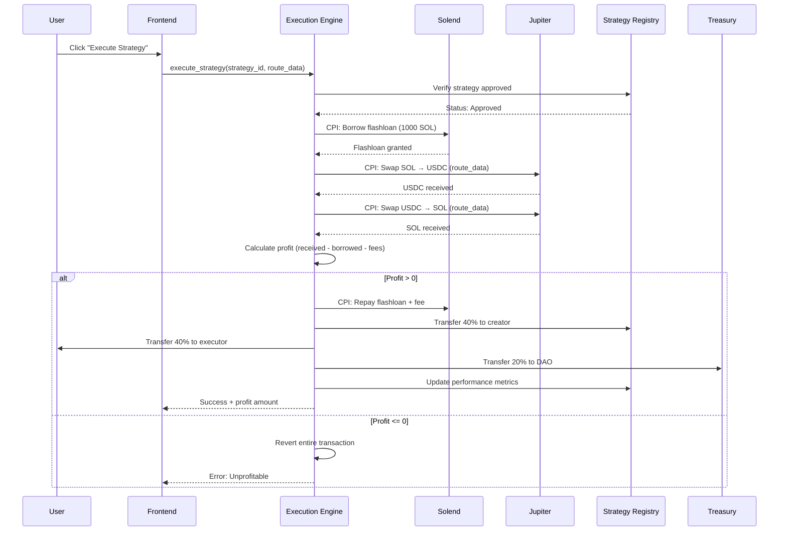
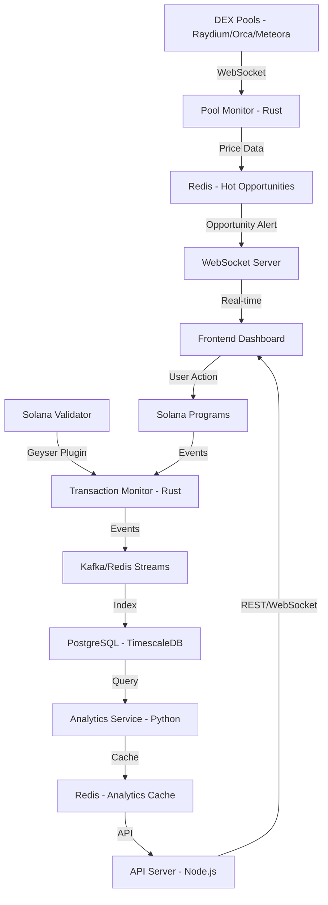
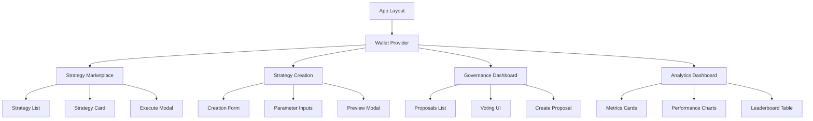

# MEVrebels - Product Requirements Document

**Version:** 1.0
**Last Updated:** October 9, 2025
**Status:** Active Development
**Project Timeline:** October 8 - October 30, 2025 (23 days)

---

## Table of Contents

1. [Executive Summary](#1-executive-summary)
2. [Product Overview](#2-product-overview)
3. [Market Analysis](#3-market-analysis)
4. [User Personas](#4-user-personas)
5. [Feature Requirements](#5-feature-requirements)
6. [Technical Architecture](#6-technical-architecture)
7. [Success Metrics & KPIs](#7-success-metrics--kpis)
8. [Timeline & Milestones](#8-timeline--milestones)
9. [Risk Management](#9-risk-management)
10. [Appendix](#10-appendix)

---

## 1. Executive Summary

### 1.1 Vision

**Democratize MEV profits through decentralized arbitrage strategies.**

MEVrebels transforms MEV (Maximal Extractable Value) from a predatory force into a community-owned utility. Instead of sophisticated bots and institutional players monopolizing billions in MEV profits, MEVrebels enables anyone—developers, traders, and passive participants—to create, execute, and profit from arbitrage strategies through decentralized infrastructure.

### 1.2 Mission

Enable anyone to create, share, and profit from arbitrage strategies on Solana through:
- **Open Strategy Registry**: Permissionless submission of arbitrage logic
- **Flashloan-Powered Execution**: Zero capital barrier to entry
- **DAO Governance**: Community-driven quality control and protocol evolution
- **Fair Profit Distribution**: Transparent revenue sharing among creators, executors, and treasury

### 1.3 Target Market

**Primary Markets:**
1. **Solana Traders** (50K+ active): Retail traders seeking MEV protection and profit opportunities
2. **MEV Searchers** (5K+): Independent searchers lacking capital or infrastructure
3. **Strategy Developers** (2K+): DeFi developers monetizing arbitrage algorithms

**Secondary Markets:**
4. **DAO Participants**: Governance enthusiasts and passive yield seekers
5. **Institutional Players**: Crypto funds seeking MEV infrastructure exposure

### 1.4 Success Criteria

**Hackathon Track (Primary Goal):**
- Top 3 placement in Superteam Earn Cypherpunk Hackathon
- Target: 1st place ($2,500 USDC)
- Minimum: 3rd place ($1,000 USDC)

**Investor Track (Secondary Goal):**
- Acquisition offer ≥$50,000
- Strategic partnership (Jito/Jupiter/Solend)
- OR Seed funding round ($100K-$500K)

**Technical Validation:**
- 10+ profitable strategies deployed on mainnet
- $10,000+ arbitrage volume executed
- 100+ successful strategy executions
- Zero critical security vulnerabilities

---

## 2. Product Overview

### 2.1 Problem Statement

#### The MEV Crisis

Maximal Extractable Value (MEV) represents over **$2 billion annually** on Solana, yet this value is extracted by a small oligopoly of sophisticated actors:

**Pain Point 1: Monopolized Profits**
- 95% of MEV captured by <100 institutional bots
- Average trader loses 0.5-2% per trade to frontrunning
- Independent developers cannot monetize strategies without capital

**Pain Point 2: High Barriers to Entry**
- Infrastructure costs: $10K+/month (RPC, servers, monitoring)
- Capital requirements: $50K+ for competitive arbitrage
- Technical complexity: Deep expertise in Solana, MEV, DEX protocols

**Pain Point 3: Centralized Control**
- Jito MEV infrastructure controlled by single entity
- No community governance over MEV distribution
- Opaque profit allocation and strategy selection

**Pain Point 4: Wasted Collective Intelligence**
- Thousands of developers with profitable strategies
- No mechanism to share and monetize algorithmic knowledge
- Fragmented, siloed MEV extraction efforts

### 2.2 Solution

**MEVrebels: The Decentralized MEV Strategy DAO**

A decentralized protocol that transforms MEV extraction from a predatory zero-sum game into a collaborative positive-sum ecosystem.

#### Core Components

**1. On-Chain Strategy Registry**
- Permissionless submission of arbitrage strategies
- Version-controlled strategy accounts (PDAs)
- Cryptographic creator attribution
- Governance-approved quality control

**2. Flashloan-Powered Execution Engine**
- Zero-capital arbitrage via Solend/marginfi flashloans
- Jupiter CPI integration for optimal routing
- Atomic transaction execution (profit or revert)
- MEV-protected submission via Jito Block Engine

**3. DAO Governance (REBEL Token)**
- Community voting on strategy approvals
- Protocol parameter governance (fees, thresholds)
- Treasury management and grants
- Transparent on-chain decision-making

**4. Fair Profit Distribution**
- Automatic split: 40% creator / 40% executor / 20% DAO treasury
- On-chain accounting and real-time settlements
- No intermediaries or custodians
- Transparent, auditable revenue flows

### 2.3 Value Proposition

#### For Strategy Creators
**"Monetize Your Alpha Without Capital"**
- Submit strategies, earn 40% revenue share on executions
- No infrastructure costs or maintenance
- Retain intellectual property rights
- Build reputation via on-chain track record

#### For Executors
**"Profit from Proven Strategies Without Expertise"**
- Execute vetted strategies using flashloans (zero capital)
- Earn 40% of profits per execution
- Access curated strategy marketplace
- Transparent performance metrics for informed selection

#### For DAO Participants
**"Govern the MEV Economy, Earn from Treasury"**
- Vote on strategy approvals and protocol upgrades
- Earn from 20% protocol treasury allocation
- Staking rewards for active governance
- Shape the future of decentralized MEV

#### For Investors
**"Exposure to $2B+ MEV Market via Decentralized Infrastructure"**
- First-mover advantage in DAO-governed MEV
- Scalable infrastructure (strategies compound value)
- Network effects: more strategies → more executors → more creators
- Defensible moat via community and governance

---

## 3. Market Analysis

### 3.1 Market Size

#### Total Addressable Market (TAM)
**$2 Billion+ Annual MEV on Solana**
- Source: Jito MEV Dashboard, Q3 2025 data
- Includes: DEX arbitrage, liquidations, sandwich attacks
- Growing 15% monthly with Solana adoption

#### Serviceable Addressable Market (SAM)
**$500 Million+ Addressable via Retail/Developers**
- DEX arbitrage subset: ~$800M annually
- Accessible to non-institutional players: 60% (~$480M)
- Target: Cross-DEX inefficiencies (Raydium, Orca, Meteora)

#### Serviceable Obtainable Market (SOM)
**$10 Million+ in Year 1 (2% Market Capture)**
- Conservative estimate: 50 active strategies
- Average profit per strategy: $200K annually
- Assumes 20% execution efficiency vs. incumbents

### 3.2 Competitive Landscape

| Competitor | Model | Strengths | Weaknesses | Differentiation |
|------------|-------|-----------|------------|-----------------|
| **Jito MEV** | Centralized MEV infrastructure | Validator integration, low latency | Closed ecosystem, institutional focus | MEVrebels is open, community-governed |
| **Manual Arbitrage Bots** | Individual operators | Custom strategies | High capital/expertise barriers | MEVrebels democratizes via flashloans + DAO |
| **Flashbots (Ethereum)** | MEV-Boost relay | Proven model, mature | Ethereum-only, no Solana version | MEVrebels brings DAO governance to Solana |
| **Jupiter Limit Orders** | DEX aggregator feature | User-friendly | Not true arbitrage, no MEV focus | MEVrebels dedicated MEV infrastructure |

**Key Differentiators:**
1. **First DAO-Governed MEV Protocol on Solana** - Community control vs. centralized
2. **Strategy Marketplace** - Open submission vs. closed/proprietary
3. **Flashloan Integration** - Zero capital barrier vs. high capital requirements
4. **Transparent Profit Sharing** - On-chain revenue distribution vs. opaque

### 3.3 Market Trends

**Trend 1: Solana Growth** (+300% TVL YoY)
- Solana DeFi TVL: $5B+ (October 2025)
- Increasing DEX volume = more MEV opportunities
- Jupiter dominance (80% DEX aggregation share)

**Trend 2: MEV Awareness** (Rising)
- Traders demanding MEV protection (Jito adoption proof)
- Regulatory scrutiny driving transparency demand
- Community preference for decentralized solutions

**Trend 3: DAO Governance Maturation**
- Successful models: Uniswap, Compound, Lido
- Trend toward on-chain governance (vs. multisig)
- Demand for utility tokens with real yield

**Trend 4: Flashloan Adoption**
- Solend, marginfi offering competitive rates
- Proven in Ethereum DeFi (Aave, dYdX)
- Enabling capital-efficient strategies

### 3.4 Go-to-Market Strategy

#### Phase 1: Hackathon Launch (Days 1-23)
- **Objective**: Win hackathon, validate concept
- **Tactics**:
  - MVP on devnet/mainnet with 5+ strategies
  - Demo video showcasing live arbitrage execution
  - Community engagement via Twitter/Discord

#### Phase 2: Community Growth (Months 1-3)
- **Objective**: 100+ active strategies, 500+ users
- **Tactics**:
  - Strategy bounties (1,000 REBEL per approved strategy)
  - Influencer partnerships (Solana Twitter, YouTube)
  - Integration partnerships (Jupiter, Solend)

#### Phase 3: Institutional Adoption (Months 4-6)
- **Objective**: $1M+ monthly volume
- **Tactics**:
  - Validator partnerships (Staking Facilities)
  - MEV analytics dashboard (attract researchers)
  - Grants program for advanced strategies

---

## 4. User Personas

### 4.1 Persona 1: Strategy Creator (Alex)

**Demographics:**
- Age: 28
- Role: DeFi Developer / Freelance Smart Contract Engineer
- Experience: 3 years Solana development, proficient in Rust/Anchor
- Location: Remote (Europe)

**Goals:**
- Monetize arbitrage algorithms without running infrastructure
- Build reputation in DeFi community
- Earn passive income from successful strategies

**Pain Points:**
- No way to earn from strategies without $50K+ capital
- Infrastructure costs ($5K/month) erode profitability
- Risk of strategy being copied once deployed

**User Story:**
> "I discovered a profitable cross-DEX arbitrage pattern between Raydium and Orca. I want to submit my strategy to MEVrebels, have the community validate it, and earn 40% revenue share every time someone executes it—without needing to manage bots or capital."

**Success Metrics:**
- Strategy approved by DAO within 3 days
- Earning $500+/week from executions
- 10+ executions per day

---

### 4.2 Persona 2: Executor (Jordan)

**Demographics:**
- Age: 24
- Role: Crypto Trader / Part-time Developer
- Experience: 2 years trading, basic Solana knowledge
- Location: Remote (Asia)

**Goals:**
- Profit from MEV without deep technical expertise
- Execute strategies using flashloans (no capital)
- Earn consistent income from arbitrage

**Pain Points:**
- Lack of profitable strategies (can't create own)
- Capital requirements ($10K+) too high
- Competing with institutional bots

**User Story:**
> "I have technical skills and understand arbitrage concepts, but I can't compete with big players. I want to browse vetted strategies on MEVrebels, execute them using flashloans, and earn 40% of profits—without risking my own capital."

**Success Metrics:**
- 5+ profitable executions per day
- Earning $200+/week
- <5s execution time (competitive advantage)

---

### 4.3 Persona 3: Passive Participant (Casey)

**Demographics:**
- Age: 35
- Role: DAO Enthusiast / Crypto Investor
- Experience: 5 years crypto investing, governance participation
- Location: Remote (North America)

**Goals:**
- Govern MEV infrastructure fairly
- Earn yield from protocol treasury
- Support decentralized alternatives to Jito

**Pain Points:**
- No say in centralized MEV infrastructure
- Opaque profit distribution
- Limited governance opportunities in DeFi

**User Story:**
> "I hold REBEL tokens and want to vote on which strategies get approved. I earn from the 20% treasury allocation, and I help ensure the protocol remains fair and community-driven—while passively benefiting from MEV profits."

**Success Metrics:**
- Voting on 10+ proposals per month
- Earning 5-10% APY from treasury distributions
- Influencing protocol direction

---

### 4.4 Persona 4: Institutional Player (Morgan)

**Demographics:**
- Age: 42
- Role: Crypto Fund Manager / MEV Research Lead
- Experience: 10 years finance, 4 years crypto/MEV
- Location: Major Financial Hub

**Goals:**
- Diversify MEV infrastructure exposure
- Access high-quality strategies at scale
- Hedge against Jito centralization risk

**Pain Points:**
- Over-reliance on Jito for MEV infrastructure
- Limited access to novel strategies
- Regulatory risk of centralized MEV

**User Story:**
> "Our fund executes $10M+ monthly MEV volume. We want to diversify beyond Jito by using MEVrebels' decentralized infrastructure, access community-vetted strategies, and potentially acquire the protocol to expand our MEV capabilities."

**Success Metrics:**
- Executing $500K+/month via MEVrebels
- 20+ institutional-grade strategies available
- Partnership/acquisition discussions initiated

---

## 5. Feature Requirements

### EPIC 1: Strategy Registry (On-Chain)

**Epic Description:** Core Solana program for registering, validating, and managing arbitrage strategies on-chain with cryptographic attribution and governance integration.

**Priority:** P0 (Critical)
**Timeline:** Days 6-11
**Owner:** Smart Contract Team
**Dependencies:** Anchor framework setup, Solana devnet access

---

#### Story 1.1: Strategy Creation & Submission

**User Story:**
As a strategy creator (Alex), I want to submit my arbitrage strategy on-chain so that it can be executed by others and I can earn revenue share.

**Acceptance Criteria:**
- ✅ Strategy account created with deterministic PDA (based on creator + strategy_id)
- ✅ Strategy parameters validated: DEXs list, token pairs, profit threshold (≥0.1%), slippage (≤5%)
- ✅ Creator pubkey attributed and immutable
- ✅ `StrategyCreated` event emitted with strategy details for off-chain indexing
- ✅ Gas-optimized (≤100K compute units)

**Tasks:**

| Task ID | Description | Owner | Estimate | Dependencies |
|---------|-------------|-------|----------|--------------|
| 1.1.1 | Design `StrategyAccount` struct (fields: creator, dexs, tokens, profit_threshold, slippage, status, performance_metrics) | Smart Contract | 4h | Anchor setup |
| 1.1.2 | Implement `create_strategy` instruction with PDA derivation | Smart Contract | 6h | Task 1.1.1 |
| 1.1.3 | Add parameter validation logic (profit_threshold ≥0.1%, slippage ≤5%, valid DEX enum) | Smart Contract | 4h | Task 1.1.2 |
| 1.1.4 | Emit `StrategyCreated` event with indexed fields (creator, strategy_id, timestamp) | Smart Contract | 2h | Task 1.1.2 |
| 1.1.5 | Write unit tests: valid creation, invalid params, duplicate prevention | Smart Contract | 6h | Task 1.1.3 |
| 1.1.6 | Add creator attribution (immutable creator field in PDA seeds) | Smart Contract | 2h | Task 1.1.2 |

**Total Estimate:** 24h (3 days)

---

#### Story 1.2: Strategy Validation & Approval

**User Story:**
As a DAO member (Casey), I want to vote on strategy approval to ensure only quality strategies are executable and protect users from scams.

**Acceptance Criteria:**
- ✅ Strategy status enum: `Pending`, `Approved`, `Rejected`
- ✅ Voting mechanism integrated with governance program (CPI)
- ✅ Approval threshold configurable (default: >50% of votes)
- ✅ Only `Approved` strategies can be executed
- ✅ Status transitions immutable (can't revert from Rejected to Pending)

**Tasks:**

| Task ID | Description | Owner | Estimate | Dependencies |
|---------|-------------|-------|----------|--------------|
| 1.2.1 | Add `status: StrategyStatus` enum field to `StrategyAccount` | Smart Contract | 2h | Task 1.1.1 |
| 1.2.2 | Implement `approve_strategy` instruction (callable only by governance) | Smart Contract | 6h | Task 1.2.1, Governance program |
| 1.2.3 | Integrate governance voting CPI (pass proposal_id to verify approval) | Smart Contract | 8h | Task 1.2.2 |
| 1.2.4 | Add approval threshold logic (configurable via DAO parameter account) | Smart Contract | 4h | Task 1.2.3 |
| 1.2.5 | Write tests: approval flow, rejection flow, unauthorized access prevention | Smart Contract | 6h | Task 1.2.4 |

**Total Estimate:** 26h (3.25 days)

---

#### Story 1.3: Strategy Performance Tracking

**User Story:**
As a user (Jordan), I want to see strategy performance metrics (profitability, execution count, success rate) to make informed decisions on which strategies to execute.

**Acceptance Criteria:**
- ✅ Metrics tracked: `total_profit_lamports`, `execution_count`, `success_count`, `last_execution_timestamp`
- ✅ Metrics updated atomically in `execute_strategy` instruction
- ✅ Success rate calculated as `success_count / execution_count`
- ✅ Queryable via `get_strategy_stats` view function
- ✅ Historical performance preserved (no overwrites)

**Tasks:**

| Task ID | Description | Owner | Estimate | Dependencies |
|---------|-------------|-------|----------|--------------|
| 1.3.1 | Add performance fields to `StrategyAccount`: total_profit, execution_count, success_count, last_execution | Smart Contract | 3h | Task 1.1.1 |
| 1.3.2 | Update metrics in `execute_strategy` instruction (increment counters, add profit) | Smart Contract | 4h | Task 1.3.1, Story 2.1 |
| 1.3.3 | Implement `get_strategy_stats` query function (returns performance struct) | Smart Contract | 3h | Task 1.3.1 |
| 1.3.4 | Emit `StrategyExecuted` event with execution result and updated metrics | Smart Contract | 2h | Task 1.3.2 |
| 1.3.5 | Write tests: metric updates, success rate calculation, edge cases (zero executions) | Smart Contract | 4h | Task 1.3.3 |

**Total Estimate:** 16h (2 days)

---

### EPIC 2: Execution Engine (On-Chain)

**Epic Description:** Atomic arbitrage execution engine with flashloan integration, Jupiter CPI for swaps, and automated profit distribution.

**Priority:** P0 (Critical)
**Timeline:** Days 8-14
**Owner:** Smart Contract Team
**Dependencies:** Solend/marginfi SDK, Jupiter CPI documentation

---

#### Story 2.1: Flashloan Integration

**User Story:**
As an executor (Jordan), I want to use flashloans from Solend to execute arbitrage without needing capital upfront.

**Acceptance Criteria:**
- ✅ Borrow flashloan from Solend (fallback: marginfi)
- ✅ Execute strategy logic (multi-hop swaps via Jupiter)
- ✅ Repay flashloan + fee (0.09% for Solend)
- ✅ Distribute profits OR revert entire transaction atomically
- ✅ Gas-optimized (≤400K compute units including Jupiter CPI)

**Tasks:**

| Task ID | Description | Owner | Estimate | Dependencies |
|---------|-------------|-------|----------|--------------|
| 2.1.1 | Study Solend flashloan CPI examples and account structure | Smart Contract | 6h | - |
| 2.1.2 | Implement `borrow_flashloan` function (CPI to Solend program) | Smart Contract | 8h | Task 2.1.1 |
| 2.1.3 | Add flashloan repayment logic (calculate fee, transfer back) | Smart Contract | 6h | Task 2.1.2 |
| 2.1.4 | Test flashloan flow: borrow → execute (mock) → repay | Smart Contract | 6h | Task 2.1.3 |
| 2.1.5 | Add marginfi fallback (if Solend pool liquidity insufficient) | Smart Contract | 8h | Task 2.1.4 |
| 2.1.6 | Error handling: insufficient liquidity, repayment failure | Smart Contract | 4h | Task 2.1.5 |

**Total Estimate:** 38h (4.75 days)

---

#### Story 2.2: Jupiter Swap Integration (CPI)

**User Story:**
As the execution engine, I need to perform multi-hop swaps via Jupiter to execute arbitrage strategies with optimal routing.

**Acceptance Criteria:**
- ✅ Calculate optimal route off-chain (Jupiter API)
- ✅ Pass route data to on-chain program (serialized accounts)
- ✅ Execute swap via Jupiter CPI (v6)
- ✅ Slippage protection enforced (max slippage from strategy params)
- ✅ Handle errors: insufficient liquidity, slippage exceeded, route stale

**Tasks:**

| Task ID | Description | Owner | Estimate | Dependencies |
|---------|-------------|-------|----------|--------------|
| 2.2.1 | Study Jupiter CPI v6 documentation and examples | Smart Contract | 6h | - |
| 2.2.2 | Implement `jupiter_swap` CPI wrapper function | Smart Contract | 8h | Task 2.2.1 |
| 2.2.3 | Add `route_data: Vec<u8>` parameter to `execute_strategy` instruction | Smart Contract | 4h | Task 2.2.2 |
| 2.2.4 | Implement slippage protection (validate output amount ≥ min_expected) | Smart Contract | 4h | Task 2.2.3 |
| 2.2.5 | Test multi-hop swap: SOL → USDC → RAY → SOL | Smart Contract | 8h | Task 2.2.4 |
| 2.2.6 | Error handling: swap failures, stale routes, account validation | Smart Contract | 6h | Task 2.2.5 |

**Total Estimate:** 36h (4.5 days)

---

#### Story 2.3: Profit Distribution

**User Story:**
As a strategy creator (Alex) and executor (Jordan), I want profits distributed fairly and automatically according to DAO-approved revenue share rules.

**Acceptance Criteria:**
- ✅ Profit calculation: `final_balance - initial_balance - flashloan_fee`
- ✅ Profit split (configurable via DAO): 40% creator, 40% executor, 20% treasury
- ✅ Automatic transfers to creator, executor, and treasury accounts
- ✅ `ProfitDistributed` event emitted with amounts
- ✅ Zero profit = no distributions, revert if negative (safety check)

**Tasks:**

| Task ID | Description | Owner | Estimate | Dependencies |
|---------|-------------|-------|----------|--------------|
| 2.3.1 | Calculate net profit after flashloan repayment in `execute_strategy` | Smart Contract | 4h | Task 2.1.3 |
| 2.3.2 | Implement profit split logic (read percentages from DAO config account) | Smart Contract | 6h | Task 2.3.1, Governance |
| 2.3.3 | Transfer funds to creator, executor, treasury accounts atomically | Smart Contract | 6h | Task 2.3.2 |
| 2.3.4 | Emit `ProfitDistributed` event (strategy_id, amounts, recipients) | Smart Contract | 2h | Task 2.3.3 |
| 2.3.5 | Test profit calculation accuracy (various scenarios: profit, break-even, loss) | Smart Contract | 6h | Task 2.3.4 |
| 2.3.6 | Add safety check: revert if net profit negative (prevent loss execution) | Smart Contract | 3h | Task 2.3.5 |

**Total Estimate:** 27h (3.4 days)

---

### EPIC 3: DAO Governance (On-Chain)

**Epic Description:** Decentralized governance system with REBEL token, proposal creation, voting mechanisms, and on-chain execution.

**Priority:** P1 (High)
**Timeline:** Days 10-15
**Owner:** Smart Contract + Tokenomics Team
**Dependencies:** SPL Token program

---

#### Story 3.1: Governance Token (REBEL)

**User Story:**
As a participant (Casey), I want to hold REBEL governance tokens to vote on proposals and earn from protocol treasury.

**Acceptance Criteria:**
- ✅ SPL token created with metadata: "REBEL", decimals=9, supply=100M
- ✅ Initial distribution:
  - 40% Community (airdrops, rewards)
  - 30% DAO Treasury
  - 20% Team (2-year vesting)
  - 10% Liquidity (DEX pairs)
- ✅ Token holder tracking for voting power calculation
- ✅ Transferable with standard SPL token interface

**Tasks:**

| Task ID | Description | Owner | Estimate | Dependencies |
|---------|-------------|-------|----------|--------------|
| 3.1.1 | Create REBEL SPL token with metadata (name, symbol, decimals) | Tokenomics | 4h | - |
| 3.1.2 | Implement token distribution logic (multi-sig controlled initially) | Tokenomics | 6h | Task 3.1.1 |
| 3.1.3 | Create token holder registry account (PDA tracking balances for voting) | Smart Contract | 6h | Task 3.1.1 |
| 3.1.4 | Write token minting tests (distribution, supply cap) | Tokenomics | 4h | Task 3.1.2 |
| 3.1.5 | Set up Raydium liquidity pool (REBEL/USDC) with 10% supply | Tokenomics | 4h | Task 3.1.1 |

**Total Estimate:** 24h (3 days)

---

#### Story 3.2: Proposal & Voting System

**User Story:**
As a DAO member (Casey), I want to create and vote on proposals to govern the protocol (strategy approvals, parameter changes, treasury spending).

**Acceptance Criteria:**
- ✅ Proposal types: `StrategyApproval`, `ParameterChange`, `TreasurySpend`
- ✅ Voting period: configurable (default 3 days)
- ✅ Quorum requirement: configurable (default 10% of circulating supply)
- ✅ Vote options: `Yes`, `No`, `Abstain`
- ✅ Execution after approval (only if quorum met + majority yes)
- ✅ One token = one vote

**Tasks:**

| Task ID | Description | Owner | Estimate | Dependencies |
|---------|-------------|-------|----------|--------------|
| 3.2.1 | Design `ProposalAccount` struct (type, description, voting_end, votes_yes/no/abstain, executed) | Smart Contract | 4h | - |
| 3.2.2 | Implement `create_proposal` instruction (requires minimum REBEL balance) | Smart Contract | 6h | Task 3.2.1, Story 3.1 |
| 3.2.3 | Implement `vote` instruction (lock tokens during voting period) | Smart Contract | 8h | Task 3.2.2 |
| 3.2.4 | Add quorum and voting period checks (configurable via governance config) | Smart Contract | 6h | Task 3.2.3 |
| 3.2.5 | Implement `execute_proposal` instruction (verify approval, execute action) | Smart Contract | 8h | Task 3.2.4 |
| 3.2.6 | Test full governance flow: create → vote → execute (various scenarios) | Smart Contract | 8h | Task 3.2.5 |
| 3.2.7 | Add delegation feature (token holders can delegate voting power) | Smart Contract | 8h | Task 3.2.6 |

**Total Estimate:** 48h (6 days)

---

#### Story 3.3: Treasury Management

**User Story:**
As the DAO (collectively), I want to manage protocol treasury funds transparently for grants, buybacks, and operational expenses.

**Acceptance Criteria:**
- ✅ Treasury account (PDA) holds 20% of strategy profits
- ✅ Treasury spending requires governance proposal approval
- ✅ Transparent accounting (all inflows/outflows on-chain)
- ✅ Multi-category budgets: Grants, Operations, Buybacks
- ✅ Treasury balance queryable in real-time

**Tasks:**

| Task ID | Description | Owner | Estimate | Dependencies |
|---------|-------------|-------|----------|--------------|
| 3.3.1 | Create treasury PDA account (holds SOL, USDC, REBEL) | Smart Contract | 4h | - |
| 3.3.2 | Implement treasury deposit logic (20% from profit distribution) | Smart Contract | 4h | Task 2.3.3 |
| 3.3.3 | Add treasury spend proposal type (requires governance approval) | Smart Contract | 6h | Task 3.2.5 |
| 3.3.4 | Implement budget tracking (on-chain categories: grants, ops, buybacks) | Smart Contract | 6h | Task 3.3.3 |
| 3.3.5 | Create treasury dashboard query endpoints (balances, historical spending) | Backend | 6h | Task 3.3.4 |

**Total Estimate:** 26h (3.25 days)

---

### EPIC 4: Backend Services (Off-Chain)

**Epic Description:** Real-time pool monitoring, opportunity detection, strategy analytics, and WebSocket infrastructure for executors.

**Priority:** P1 (High)
**Timeline:** Days 12-17
**Owner:** Backend Team
**Dependencies:** RPC access (Helius/QuickNode), Redis, PostgreSQL

---

#### Story 4.1: Pool Monitoring Service

**User Story:**
As the system, I need to monitor DEX pools in real-time to detect arbitrage opportunities and alert executors immediately.

**Acceptance Criteria:**
- ✅ Real-time pool data from Raydium, Orca, Meteora (WebSocket subscriptions)
- ✅ Price discrepancy detection (>0.5% difference = opportunity)
- ✅ Opportunity scoring algorithm (profit potential, execution probability)
- ✅ Broadcast opportunities via WebSocket to connected executors
- ✅ Latency <500ms from pool update to executor notification

**Tasks:**

| Task ID | Description | Owner | Estimate | Dependencies |
|---------|-------------|-------|----------|--------------|
| 4.1.1 | Integrate Raydium API/WebSocket for pool updates | Backend (Rust) | 8h | RPC access |
| 4.1.2 | Integrate Orca & Meteora pool monitoring | Backend (Rust) | 8h | Task 4.1.1 |
| 4.1.3 | Implement price discrepancy detection algorithm (cross-DEX comparison) | Backend (Rust) | 6h | Task 4.1.2 |
| 4.1.4 | Set up Redis for hot opportunities (TTL 10s) | Backend | 4h | Redis setup |
| 4.1.5 | Build WebSocket server for broadcasting opportunities to clients | Backend (Node.js) | 8h | Task 4.1.4 |
| 4.1.6 | Add opportunity scoring (profit estimate, gas cost, success probability) | Backend (Python) | 6h | Task 4.1.3 |
| 4.1.7 | Performance optimization: <500ms latency target | Backend | 6h | Task 4.1.5 |

**Total Estimate:** 46h (5.75 days)

---

#### Story 4.2: Strategy Analytics Service

**User Story:**
As a user (Jordan/Alex), I want to see detailed strategy performance metrics and leaderboards in the dashboard to make data-driven decisions.

**Acceptance Criteria:**
- ✅ Historical performance data (daily/weekly/monthly profits)
- ✅ Strategy leaderboard (top 10 by profit, execution count, success rate)
- ✅ Creator earnings tracking (lifetime + recent)
- ✅ API endpoints: `/api/strategies/stats`, `/api/leaderboard`, `/api/creator/:pubkey/earnings`
- ✅ Data refreshed every 5 minutes (cached)

**Tasks:**

| Task ID | Description | Owner | Estimate | Dependencies |
|---------|-------------|-------|----------|--------------|
| 4.2.1 | Index on-chain events (StrategyCreated, StrategyExecuted) to PostgreSQL | Backend | 8h | PostgreSQL setup |
| 4.2.2 | Calculate strategy performance metrics (profit, ROI, success rate) | Backend (Python) | 6h | Task 4.2.1 |
| 4.2.3 | Build leaderboard API endpoint (top strategies by various metrics) | Backend (Node.js) | 6h | Task 4.2.2 |
| 4.2.4 | Add creator earnings aggregation (sum profits per creator) | Backend | 4h | Task 4.2.1 |
| 4.2.5 | Implement caching layer (Redis) for analytics (5min TTL) | Backend | 4h | Task 4.2.3 |
| 4.2.6 | Add historical charts data endpoints (time-series profits) | Backend | 6h | Task 4.2.2 |

**Total Estimate:** 34h (4.25 days)

---

#### Story 4.3: Transaction Monitoring & Alerts

**User Story:**
As an executor (Jordan), I want real-time alerts when my strategy executions succeed or fail so I can monitor performance.

**Acceptance Criteria:**
- ✅ Monitor on-chain transactions for execution results
- ✅ Parse success/failure from transaction logs
- ✅ Send alerts via WebSocket (real-time) and email (optional)
- ✅ Alert includes: strategy_id, profit/loss, gas used, timestamp
- ✅ Executor-specific filtering (only their executions)

**Tasks:**

| Task ID | Description | Owner | Estimate | Dependencies |
|---------|-------------|-------|----------|--------------|
| 4.3.1 | Set up Geyser plugin or RPC transaction monitoring | Backend (Rust) | 8h | RPC access |
| 4.3.2 | Parse transaction logs for StrategyExecuted events | Backend (Rust) | 6h | Task 4.3.1 |
| 4.3.3 | Implement WebSocket alert broadcast (filtered by executor pubkey) | Backend | 4h | Task 4.1.5 |
| 4.3.4 | Add optional email alerts (SendGrid integration) | Backend | 4h | Task 4.3.3 |
| 4.3.5 | Store execution history in PostgreSQL for dashboard | Backend | 4h | Task 4.3.2 |

**Total Estimate:** 26h (3.25 days)

---

### EPIC 5: Dashboard & UI (Frontend)

**Epic Description:** User-friendly Next.js dashboard for strategy marketplace, creation, governance, and analytics visualization.

**Priority:** P0 (Critical)
**Timeline:** Days 15-20
**Owner:** Frontend Team
**Dependencies:** Backend APIs, Solana Wallet Adapter, shadcn/ui

---

#### Story 5.1: Strategy Marketplace

**User Story:**
As an executor (Jordan), I want to browse and select approved strategies with performance metrics to execute profitable arbitrage.

**Acceptance Criteria:**
- ✅ List all approved strategies (paginated, 20 per page)
- ✅ Filter by: DEX, token pair, min profitability, success rate
- ✅ Sort by: total profit, execution count, success rate, recent activity
- ✅ Strategy card shows: name, creator, profit, success rate, execute button
- ✅ Execute button triggers wallet transaction flow
- ✅ Real-time updates via WebSocket (new strategies appear instantly)

**Tasks:**

| Task ID | Description | Owner | Estimate | Dependencies |
|---------|-------------|-------|----------|--------------|
| 5.1.1 | Build strategy list component with shadcn/ui Table | Frontend (React) | 6h | - |
| 5.1.2 | Integrate with backend API (`/api/strategies?status=approved`) | Frontend | 4h | Story 4.2 |
| 5.1.3 | Add filtering UI (dropdown for DEX, slider for min profit) | Frontend | 6h | Task 5.1.2 |
| 5.1.4 | Implement sorting controls (profit, executions, success rate) | Frontend | 4h | Task 5.1.2 |
| 5.1.5 | Build strategy card component (displays key metrics) | Frontend | 4h | Task 5.1.1 |
| 5.1.6 | Implement execute strategy flow (wallet sign → submit tx → confirm) | Frontend | 8h | Wallet Adapter |
| 5.1.7 | Add WebSocket subscription for real-time strategy updates | Frontend | 6h | Story 4.1 |

**Total Estimate:** 38h (4.75 days)

---

#### Story 5.2: Strategy Creation Form

**User Story:**
As a strategy creator (Alex), I want an intuitive UI to submit my arbitrage strategy without writing code directly.

**Acceptance Criteria:**
- ✅ Form inputs: Strategy name, DEXs (multi-select), token pairs, profit threshold, max slippage
- ✅ Client-side validation (required fields, numeric ranges)
- ✅ Preview strategy parameters before submission
- ✅ Wallet transaction signing via Solana Wallet Adapter
- ✅ Transaction status display (pending → confirmed → success/error)
- ✅ Success notification with strategy ID

**Tasks:**

| Task ID | Description | Owner | Estimate | Dependencies |
|---------|-------------|-------|----------|--------------|
| 5.2.1 | Build strategy creation form layout (shadcn/ui Form components) | Frontend | 6h | - |
| 5.2.2 | Add input validation (Zod schema: profit ≥0.1%, slippage ≤5%) | Frontend | 4h | Task 5.2.1 |
| 5.2.3 | Integrate with `create_strategy` program instruction | Frontend | 6h | Wallet Adapter, Anchor client |
| 5.2.4 | Show transaction status (useWallet hook + transaction confirmation) | Frontend | 4h | Task 5.2.3 |
| 5.2.5 | Add success/error notifications (toast messages) | Frontend | 2h | Task 5.2.4 |
| 5.2.6 | Build strategy preview modal (confirm before submit) | Frontend | 4h | Task 5.2.2 |

**Total Estimate:** 26h (3.25 days)

---

#### Story 5.3: Governance Dashboard

**User Story:**
As a DAO member (Casey), I want to view active proposals, vote, and track governance history in a clean interface.

**Acceptance Criteria:**
- ✅ List active proposals (sorted by voting end date)
- ✅ Proposal card shows: title, type, description, votes (yes/no/abstain), time remaining
- ✅ Vote buttons (yes/no/abstain) with wallet signature
- ✅ Show voting progress bar (quorum indicator)
- ✅ Proposal history tab (executed, rejected)
- ✅ Create proposal button (for token holders)

**Tasks:**

| Task ID | Description | Owner | Estimate | Dependencies |
|---------|-------------|-------|----------|--------------|
| 5.3.1 | Build proposals list component (active vs. historical tabs) | Frontend | 6h | - |
| 5.3.2 | Integrate with governance API (`/api/proposals`) | Frontend | 4h | Story 3.2 |
| 5.3.3 | Implement voting UI (buttons + wallet transaction) | Frontend | 6h | Wallet Adapter |
| 5.3.4 | Show vote results and quorum progress (progress bar, percentages) | Frontend | 4h | Task 5.3.2 |
| 5.3.5 | Add proposal creation UI (form for title, description, type) | Frontend | 6h | Task 5.3.3 |
| 5.3.6 | Display proposal history (executed/rejected with results) | Frontend | 4h | Task 5.3.2 |

**Total Estimate:** 30h (3.75 days)

---

#### Story 5.4: Analytics & Performance Dashboard

**User Story:**
As a user (any persona), I want to see protocol-wide metrics, my personal earnings, and visual charts to understand performance.

**Acceptance Criteria:**
- ✅ Protocol metrics: Total volume, total profits, active strategies, total executions
- ✅ User-specific earnings (creator + executor revenue)
- ✅ Strategy leaderboard (top 10 with metrics)
- ✅ Charts: Volume over time (7d/30d), top strategies by profit (bar chart)
- ✅ Responsive design (mobile-friendly)

**Tasks:**

| Task ID | Description | Owner | Estimate | Dependencies |
|---------|-------------|-------|----------|--------------|
| 5.4.1 | Build analytics dashboard layout (grid with metric cards) | Frontend | 6h | - |
| 5.4.2 | Integrate with analytics API (`/api/analytics/overview`) | Frontend | 4h | Story 4.2 |
| 5.4.3 | Add charts using Recharts (line chart: volume, bar chart: top strategies) | Frontend | 8h | Task 5.4.2 |
| 5.4.4 | Show user-specific earnings (query by wallet pubkey) | Frontend | 4h | Task 5.4.2 |
| 5.4.5 | Add leaderboard table (top 10 strategies, sortable) | Frontend | 4h | Story 4.2 |
| 5.4.6 | Responsive design (Tailwind breakpoints for mobile) | Frontend | 4h | Task 5.4.1 |

**Total Estimate:** 30h (3.75 days)

---

### EPIC 6: Testing & Security (QA)

**Epic Description:** Comprehensive testing suite, security audits, and performance optimization to ensure production-ready quality.

**Priority:** P0 (Critical)
**Timeline:** Days 19-21
**Owner:** QA + Security Team
**Dependencies:** All features completed

---

#### Story 6.1: Security Audit

**User Story:**
As a user (all personas), I trust that the protocol is secure from common attacks (reentrancy, access control, arithmetic errors, flashloan exploits).

**Acceptance Criteria:**
- ✅ No reentrancy vulnerabilities (CPI guards implemented)
- ✅ Proper access control (only authorized signers can call privileged instructions)
- ✅ Arithmetic overflow/underflow protection (use checked math)
- ✅ Secure flashloan repayment (cannot skip or manipulate)
- ✅ Input validation on all user-provided data
- ✅ Zero critical/high vulnerabilities identified

**Tasks:**

| Task ID | Description | Owner | Estimate | Dependencies |
|---------|-------------|-------|----------|--------------|
| 6.1.1 | Conduct reentrancy attack tests (attempt malicious CPI callbacks) | Security | 6h | - |
| 6.1.2 | Validate access control on all instructions (unauthorized signer tests) | Security | 6h | Task 6.1.1 |
| 6.1.3 | Test arithmetic operations (overflow/underflow scenarios) | Security | 4h | Task 6.1.2 |
| 6.1.4 | Audit flashloan repayment logic (attempt to skip repayment) | Security | 6h | Task 6.1.3 |
| 6.1.5 | Penetration testing on API endpoints (SQL injection, rate limits) | Security | 6h | Backend APIs |
| 6.1.6 | Fix identified vulnerabilities (high priority) | Smart Contract | 8h | Task 6.1.5 |
| 6.1.7 | Document security measures in SECURITY.md | Security | 4h | Task 6.1.6 |

**Total Estimate:** 40h (5 days)

---

#### Story 6.2: Performance Testing

**User Story:**
As a user (Jordan), I expect fast execution (<5s end-to-end), responsive UI (<3s load), and reliable infrastructure (handle 100+ concurrent executions).

**Acceptance Criteria:**
- ✅ Strategy execution <5s (submit → confirm → profit distributed)
- ✅ Dashboard initial load <3s
- ✅ API response time <200ms (p95)
- ✅ Handle 100+ concurrent strategy executions without errors
- ✅ WebSocket latency <500ms (pool update → executor notification)

**Tasks:**

| Task ID | Description | Owner | Estimate | Dependencies |
|---------|-------------|-------|----------|--------------|
| 6.2.1 | Load test with k6 (simulate 1000+ API requests) | QA | 6h | - |
| 6.2.2 | Optimize Solana program compute units (target <400K per execution) | Smart Contract | 8h | Task 6.2.1 |
| 6.2.3 | Implement Redis caching for hot data (strategies, leaderboard) | Backend | 6h | Task 6.2.2 |
| 6.2.4 | Frontend performance profiling (Lighthouse, Core Web Vitals) | Frontend | 4h | Task 6.2.3 |
| 6.2.5 | Database query optimization (indexes, query plan analysis) | Backend | 6h | Task 6.2.4 |
| 6.2.6 | Stress test concurrent executions (100+ simultaneous) | QA | 6h | Task 6.2.5 |

**Total Estimate:** 36h (4.5 days)

---

#### Story 6.3: Integration Testing

**User Story:**
As a developer, I want comprehensive integration tests covering all critical user flows to ensure end-to-end functionality.

**Acceptance Criteria:**
- ✅ End-to-end test: Create strategy → DAO approval → Execute → Profit distributed
- ✅ Cross-program invocation tests (flashloan + Jupiter + profit distribution)
- ✅ Governance flow test (create proposal → vote → execute)
- ✅ API integration tests (backend → on-chain program)
- ✅ 80%+ code coverage on critical paths

**Tasks:**

| Task ID | Description | Owner | Estimate | Dependencies |
|---------|-------------|-------|----------|--------------|
| 6.3.1 | Write end-to-end test: strategy lifecycle (create → approve → execute) | QA | 8h | - |
| 6.3.2 | Test cross-program invocations (CPI success and failure scenarios) | QA | 8h | Task 6.3.1 |
| 6.3.3 | Governance flow integration test (proposal → vote → execution) | QA | 6h | Task 6.3.2 |
| 6.3.4 | API integration tests (REST + WebSocket) | QA | 6h | Task 6.3.3 |
| 6.3.5 | Measure code coverage (aim for 80%+ on core logic) | QA | 4h | Task 6.3.4 |

**Total Estimate:** 32h (4 days)

---

### EPIC 7: Documentation & Marketing (Launch)

**Epic Description:** Investor-ready documentation, compelling demo video, community engagement, and hackathon submission materials.

**Priority:** P0 (Critical)
**Timeline:** Days 22-23
**Owner:** Content + Marketing Team
**Dependencies:** All features complete

---

#### Story 7.1: Comprehensive Documentation

**User Story:**
As a new user/investor/developer, I want clear documentation to understand the protocol, set it up, and start using/contributing.

**Acceptance Criteria:**
- ✅ README.md: Overview, quick start, features, tech stack
- ✅ Architecture diagrams: Program interactions, data flow, backend pipeline
- ✅ Strategy creation guide (step-by-step tutorial)
- ✅ API documentation (REST endpoints, WebSocket events)
- ✅ Code comments on complex logic
- ✅ FAQ and troubleshooting section

**Tasks:**

| Task ID | Description | Owner | Estimate | Dependencies |
|---------|-------------|-------|----------|--------------|
| 7.1.1 | Write README.md (project overview, setup, usage, features) | Content | 6h | - |
| 7.1.2 | Create architecture diagrams (Mermaid: program flow, data pipeline) | Content | 6h | Task 7.1.1 |
| 7.1.3 | Write strategy creation tutorial (markdown with screenshots) | Content | 4h | Task 7.1.1 |
| 7.1.4 | Document API endpoints (OpenAPI spec or markdown tables) | Content | 6h | Backend APIs |
| 7.1.5 | Add inline code comments to complex on-chain logic | Smart Contract | 4h | Task 7.1.4 |
| 7.1.6 | Create FAQ.md (common questions, troubleshooting) | Content | 4h | Task 7.1.5 |

**Total Estimate:** 30h (3.75 days)

---

#### Story 7.2: Demo Video & Pitch

**User Story:**
As a judge/investor, I want to see the value proposition and live demo in a compelling 5-10 minute video.

**Acceptance Criteria:**
- ✅ 5-10 minute professional video
- ✅ Structure: Problem statement (1 min) → Solution overview (2 min) → Live demo (5 min) → Impact & call-to-action (1 min)
- ✅ Shows live arbitrage execution (not slides)
- ✅ Highlights key differentiators (DAO governance, flashloans, profit sharing)
- ✅ Professional quality (clear audio, smooth visuals, captions)
- ✅ Uploaded to YouTube with SEO-optimized description

**Tasks:**

| Task ID | Description | Owner | Estimate | Dependencies |
|---------|-------------|-------|----------|--------------|
| 7.2.1 | Write demo script (problem → solution → demo → impact) | Marketing | 4h | - |
| 7.2.2 | Record screen capture (strategy creation → execution with live profit) | Marketing | 4h | Production deployment |
| 7.2.3 | Record professional voiceover (clear, engaging, paced well) | Marketing | 4h | Task 7.2.1 |
| 7.2.4 | Edit video (cut, transitions, captions, branding) | Marketing | 8h | Task 7.2.2, 7.2.3 |
| 7.2.5 | Add background music and polish (professional finish) | Marketing | 4h | Task 7.2.4 |
| 7.2.6 | Upload to YouTube with SEO description, share on Twitter/Discord | Marketing | 2h | Task 7.2.5 |

**Total Estimate:** 26h (3.25 days)

---

#### Story 7.3: Community Engagement & Launch

**User Story:**
As the team, we want to build community awareness and excitement before/during hackathon submission to maximize impact.

**Acceptance Criteria:**
- ✅ 100+ Discord members pre-launch
- ✅ 500+ Twitter followers
- ✅ 5+ influential Solana community tweets/shares
- ✅ Beta testers recruited (10+ active users)
- ✅ Press kit ready (logo, tagline, one-pager)

**Tasks:**

| Task ID | Description | Owner | Estimate | Dependencies |
|---------|-------------|-------|----------|--------------|
| 7.3.1 | Set up Discord server (channels: announcements, support, strategies, governance) | Marketing | 4h | - |
| 7.3.2 | Launch Twitter campaign (daily tweets, engage with Solana influencers) | Marketing | 8h | Task 7.3.1 |
| 7.3.3 | Recruit beta testers (outreach to Solana Discord, Twitter DMs) | Marketing | 6h | Task 7.3.2 |
| 7.3.4 | Create press kit (logo, tagline, one-pager PDF) | Marketing | 6h | Task 7.3.3 |
| 7.3.5 | Coordinate influencer partnerships (share demo, request tweets) | Marketing | 6h | Task 7.3.4 |

**Total Estimate:** 30h (3.75 days)

---

#### Story 7.4: Hackathon Submission

**User Story:**
As the team, we want to submit a polished, complete hackathon entry that maximizes our winning chances.

**Acceptance Criteria:**
- ✅ GitHub repo public, well-organized, secrets removed
- ✅ Submission form completed on Superteam Earn
- ✅ Demo video linked (YouTube)
- ✅ Live deployment accessible (mainnet preferred, devnet acceptable)
- ✅ All documentation complete (README, architecture, API docs)
- ✅ Notify Staking Facilities directly (bonus points!)

**Tasks:**

| Task ID | Description | Owner | Estimate | Dependencies |
|---------|-------------|-------|----------|--------------|
| 7.4.1 | Clean up GitHub repo (remove secrets, organize files, add LICENSE) | DevOps | 4h | - |
| 7.4.2 | Deploy to production (Railway/Render for backend, Vercel for frontend) | DevOps | 6h | Task 7.4.1 |
| 7.4.3 | Fill out Superteam Earn submission form (all fields complete) | Marketing | 2h | Task 7.4.2 |
| 7.4.4 | Double-check all links work (GitHub, demo, live app) | QA | 2h | Task 7.4.3 |
| 7.4.5 | Submit and share on Twitter (tag @SuperteamEarn, @stakingfac) | Marketing | 2h | Task 7.4.4 |
| 7.4.6 | Direct outreach to Staking Facilities (Telegram @Maurice_08) | Team Lead | 2h | Task 7.4.5 |

**Total Estimate:** 18h (2.25 days)

---

## 6. Technical Architecture

### 6.1 System Overview

MEVrebels is a multi-layered decentralized application consisting of on-chain Solana programs, off-chain backend services, and a user-facing web dashboard. The architecture follows a modular design for scalability and maintainability.

```
┌─────────────────────────────────────────────────────────────┐
│                         FRONTEND                            │
│  Next.js Dashboard (Vercel) + Solana Wallet Adapter        │
│  - Strategy Marketplace  - Governance  - Analytics          │
└─────────────────┬───────────────────────────────────────────┘
                  │ WebSocket + REST API
┌─────────────────▼───────────────────────────────────────────┐
│                      BACKEND SERVICES                        │
│  ┌──────────────┐  ┌──────────────┐  ┌──────────────────┐  │
│  │ Pool Monitor │  │  Analytics   │  │  Transaction     │  │
│  │  (Rust)      │  │  (Python)    │  │  Monitor (Rust)  │  │
│  └──────────────┘  └──────────────┘  └──────────────────┘  │
│  ┌──────────────────────────────────────────────────────┐  │
│  │  API Server (Node.js/TypeScript)                     │  │
│  │  - REST Endpoints  - WebSocket Server  - Auth        │  │
│  └──────────────────────────────────────────────────────┘  │
│  ┌──────────────┐  ┌──────────────┐  ┌──────────────────┐  │
│  │  PostgreSQL  │  │    Redis     │  │  Kafka/Redis     │  │
│  │  (TimescaleDB)│  │    Cache     │  │   Streams        │  │
│  └──────────────┘  └──────────────┘  └──────────────────┘  │
└─────────────────┬───────────────────────────────────────────┘
                  │ RPC Calls / Event Indexing
┌─────────────────▼───────────────────────────────────────────┐
│                    SOLANA BLOCKCHAIN                         │
│  ┌────────────────────────────────────────────────────────┐ │
│  │  MEVrebels Programs (Anchor)                           │ │
│  │  ┌──────────────┐  ┌──────────────┐  ┌─────────────┐  │ │
│  │  │  Strategy    │  │  Execution   │  │  Governance │  │ │
│  │  │  Registry    │  │  Engine      │  │  (DAO)      │  │ │
│  │  └──────────────┘  └──────────────┘  └─────────────┘  │ │
│  └────────────────────────────────────────────────────────┘ │
│  ┌────────────────────────────────────────────────────────┐ │
│  │  External Programs (CPI)                               │ │
│  │  - Solend (Flashloans)  - Jupiter (Swaps)             │ │
│  │  - Raydium, Orca, Meteora (DEXs)                      │ │
│  └────────────────────────────────────────────────────────┘ │
└─────────────────────────────────────────────────────────────┘
```

### 6.2 On-Chain Architecture

#### Program Structure

**Program 1: Strategy Registry** (`mevrebels_strategy_registry`)
- Manages strategy lifecycle (creation, approval, tracking)
- Stores strategy metadata and performance metrics
- Emits events for off-chain indexing

**Program 2: Execution Engine** (`mevrebels_execution`)
- Executes atomic arbitrage transactions
- Integrates flashloans (Solend CPI)
- Performs swaps (Jupiter CPI)
- Distributes profits

**Program 3: Governance** (`mevrebels_governance`)
- Manages REBEL token and voting
- Handles proposals and execution
- Controls protocol parameters and treasury

#### Account Structure

**StrategyAccount (PDA)**
```rust
pub struct StrategyAccount {
    pub creator: Pubkey,               // Immutable creator attribution
    pub strategy_id: u64,              // Unique identifier
    pub dexs: Vec<DexType>,            // DEXs involved (Raydium, Orca, etc.)
    pub token_pairs: Vec<TokenPair>,   // Token pairs for arbitrage
    pub profit_threshold: u16,         // Minimum profit (bps, e.g., 50 = 0.5%)
    pub max_slippage: u16,             // Max slippage (bps)
    pub status: StrategyStatus,        // Pending/Approved/Rejected
    pub total_profit: u64,             // Cumulative profit (lamports)
    pub execution_count: u64,          // Total executions
    pub success_count: u64,            // Successful executions
    pub last_execution: i64,           // Unix timestamp
    pub bump: u8,                      // PDA bump seed
}
```

**ProposalAccount (PDA)**
```rust
pub struct ProposalAccount {
    pub proposal_id: u64,
    pub proposal_type: ProposalType,   // StrategyApproval/ParameterChange/TreasurySpend
    pub proposer: Pubkey,
    pub description: String,
    pub voting_end: i64,               // Unix timestamp
    pub votes_yes: u64,
    pub votes_no: u64,
    pub votes_abstain: u64,
    pub executed: bool,
    pub quorum_reached: bool,
    pub bump: u8,
}
```

#### Key Instructions

1. `create_strategy(dexs, tokens, profit_threshold, slippage)` → Creates strategy PDA
2. `approve_strategy(strategy_id, proposal_id)` → Approves via governance
3. `execute_strategy(strategy_id, route_data)` → Atomic execution with flashloan
4. `create_proposal(type, description)` → Creates governance proposal
5. `vote(proposal_id, vote_type)` → Casts vote
6. `execute_proposal(proposal_id)` → Executes approved proposal

### 6.3 Backend Architecture

#### Service Pipeline

```
Validator/RPC → Kafka/Redis Streams → Processing Workers → PostgreSQL
                                                          → WebSocket Server
                                                          → Analytics Engine
```

#### Components

**1. Pool Monitoring Service (Rust)**
- Subscribes to DEX pool updates (Raydium, Orca, Meteora)
- Detects price discrepancies (>0.5% difference)
- Publishes opportunities to Redis (TTL 10s)
- Latency target: <500ms

**2. Transaction Monitor (Rust)**
- Geyser plugin or RPC subscription for transactions
- Parses execution results from logs
- Indexes events to PostgreSQL
- Broadcasts alerts via WebSocket

**3. Analytics Service (Python)**
- Aggregates strategy performance (profit, success rate)
- Generates leaderboards
- Calculates creator/executor earnings
- Caches results in Redis (5min TTL)

**4. API Server (Node.js/TypeScript)**
- REST endpoints: `/api/strategies`, `/api/leaderboard`, `/api/proposals`
- WebSocket server for real-time updates
- Authentication (wallet signature verification)
- Rate limiting (100 req/min per IP)

**5. Data Storage**
- **PostgreSQL (TimescaleDB)**: Time-series data (executions, profits)
- **Redis**: Hot cache (opportunities, analytics, leaderboard)
- **Kafka/Redis Streams**: Event streaming and processing

### 6.4 Frontend Architecture

#### Technology Stack
- **Framework**: Next.js 14 (App Router)
- **Wallet**: Solana Wallet Adapter v2
- **UI**: shadcn/ui + Tailwind CSS
- **State**: Zustand (global state)
- **Data Fetching**: SWR (REST), native WebSocket
- **Charts**: Recharts

#### Page Structure
```
/                        → Landing page + strategy marketplace
/strategies/create       → Strategy creation form
/governance              → Proposals and voting
/analytics               → Performance dashboard
/profile/:pubkey         → User earnings and history
```

#### Data Flow
1. User connects wallet (Phantom, Solflare, etc.)
2. Frontend fetches strategies from API
3. WebSocket connection for real-time updates
4. User triggers execute → Anchor client builds tx → Wallet signs → Submit to RPC
5. Transaction confirmation → Update UI

### 6.5 Security Architecture

#### On-Chain Security
- **Reentrancy Protection**: CPI guards on all cross-program calls
- **Access Control**: Signer validation on privileged instructions
- **Arithmetic Safety**: Checked math operations (no overflow/underflow)
- **Flashloan Safety**: Atomic repayment (revert if insufficient)

#### Backend Security
- **API Rate Limiting**: 100 req/min per IP
- **Input Validation**: Zod schemas on all endpoints
- **SQL Injection Prevention**: Parameterized queries
- **CORS**: Whitelist frontend domains only

#### Frontend Security
- **Wallet Signature Verification**: All state-changing operations
- **HTTPS Only**: No HTTP in production
- **Content Security Policy**: Prevent XSS
- **No Sensitive Data**: Never expose private keys

---

## 7. Success Metrics & KPIs

### 7.1 Hackathon Success Metrics

**Primary Goal: Top 3 Placement**

| Metric | Target | Minimum Acceptable |
|--------|--------|-------------------|
| Judging Score | 85+ / 100 | 75+ / 100 |
| Final Placement | 1st place ($2,500) | 3rd place ($1,000) |
| Technical Implementation Score | 38+ / 40 | 32+ / 40 |
| Innovation & Impact Score | 22+ / 25 | 19+ / 25 |
| Infrastructure Bonus | 10 / 10 (validator partnership) | 5 / 10 |
| Documentation & Demo Score | 14+ / 15 | 12+ / 15 |
| Presentation & Polish Score | 9+ / 10 | 7+ / 10 |

**Success Breakdown (per Judging Criteria):**
- **Technical Implementation (40%)**: 4 focus areas covered, clean code, security audit passed
- **Innovation (25%)**: First DAO-governed MEV on Solana, novel profit-sharing model
- **Infrastructure Bonus (10%)**: Validator partnership with Staking Facilities
- **Documentation (15%)**: Comprehensive README, architecture diagrams, API docs, video demo
- **Presentation (10%)**: Professional video, live demo, compelling narrative

### 7.2 Technical KPIs

**On-Chain Performance**

| Metric | Target | Critical Threshold |
|--------|--------|-------------------|
| Strategy Execution Time | <5s (end-to-end) | <10s |
| Program Compute Units | <400K per execution | <600K |
| Transaction Success Rate | >95% | >85% |
| Flashloan Repayment Success | 100% | 100% (critical) |
| Concurrent Executions | 100+ without errors | 50+ |

**Backend Performance**

| Metric | Target | Critical Threshold |
|--------|--------|-------------------|
| API Response Time (p95) | <200ms | <500ms |
| WebSocket Latency | <500ms | <1s |
| Pool Update Detection | <500ms | <1s |
| Database Query Time (p95) | <100ms | <300ms |
| Uptime | 99.9% | 99% |

**Frontend Performance**

| Metric | Target | Critical Threshold |
|--------|--------|-------------------|
| Initial Load Time | <3s | <5s |
| Time to Interactive | <4s | <6s |
| Core Web Vitals (LCP) | <2.5s | <4s |
| First Contentful Paint | <1.5s | <2.5s |

### 7.3 Business KPIs (Post-Launch)

**Adoption Metrics**

| Metric | Week 1 | Month 1 | Month 3 |
|--------|--------|---------|---------|
| Active Strategies | 10+ | 50+ | 200+ |
| Total Executions | 100+ | 1,000+ | 10,000+ |
| Unique Executors | 20+ | 100+ | 500+ |
| Strategy Creators | 5+ | 25+ | 100+ |
| Total Volume | $10K+ | $100K+ | $1M+ |

**Financial Metrics**

| Metric | Week 1 | Month 1 | Month 3 |
|--------|--------|---------|---------|
| Total Profits Generated | $1K+ | $10K+ | $100K+ |
| Creator Earnings (40%) | $400+ | $4K+ | $40K+ |
| Executor Earnings (40%) | $400+ | $4K+ | $40K+ |
| DAO Treasury (20%) | $200+ | $2K+ | $20K+ |
| Protocol Revenue Run Rate | - | $120K/year | $1.2M/year |

**Community Metrics**

| Metric | Week 1 | Month 1 | Month 3 |
|--------|--------|---------|---------|
| Discord Members | 100+ | 500+ | 2,000+ |
| Twitter Followers | 500+ | 2,000+ | 10,000+ |
| Daily Active Users | 50+ | 200+ | 1,000+ |
| Governance Proposals | 5+ | 20+ | 100+ |
| REBEL Token Holders | 100+ | 500+ | 5,000+ |

### 7.4 Investor Success Metrics

**If Pursuing Acquisition/Funding:**

| Metric | Target | Rationale |
|--------|--------|-----------|
| Acquisition Offer | $50K+ | Validates product-market fit |
| Seed Funding Round | $100K-$500K | Enables 6-12 month runway |
| Strategic Partnership | Jito/Jupiter/Solend | Infrastructure integration |
| Monthly Recurring Revenue | $10K+ | Demonstrates revenue model |
| User Retention (30-day) | >40% | Proves engagement |
| MEV Market Capture | 0.5%+ ($10M annually) | Shows scalability |

### 7.5 Quality Assurance Metrics

**Security**

| Metric | Target | Critical |
|--------|--------|----------|
| Critical Vulnerabilities | 0 | 0 (blocker) |
| High Vulnerabilities | 0 | <2 |
| Medium Vulnerabilities | <3 | <5 |
| Security Audit Score | A+ | B+ minimum |

**Testing Coverage**

| Component | Target Coverage | Minimum |
|-----------|----------------|---------|
| On-Chain Programs | >90% | >80% |
| Backend Services | >85% | >75% |
| Frontend Components | >75% | >65% |
| Integration Tests | All critical paths | 80% of critical paths |

**Code Quality**

| Metric | Target | Minimum |
|--------|--------|---------|
| Linting Errors | 0 | 0 |
| TypeScript Strict Mode | Enabled | Enabled |
| Documentation Coverage | >80% of public APIs | >60% |
| Technical Debt Ratio | <5% | <10% |

---

## 8. Timeline & Milestones

### 8.1 Development Phases

**Phase 1: Research & Architecture (Days 1-5)**
- Day 1-2: Deep dive into Solana MEV ecosystem (Jito, Jupiter, Solend)
- Day 3-4: Finalize architecture, design program accounts
- Day 5: Development environment setup, Anchor initialization
- **Milestone**: Architecture locked, PRD approved, dev environment ready

**Phase 2: Core Development (Days 6-18)**
- Days 6-11: On-chain programs (Strategy Registry + Execution Engine)
- Days 10-15: DAO Governance program
- Days 12-17: Backend services (pool monitoring, analytics)
- Days 15-18: Frontend dashboard (marketplace, creation, governance)
- **Milestone**: All features functional on devnet

**Phase 3: Testing & Refinement (Days 19-21)**
- Day 19: Security audit and vulnerability fixes
- Day 20: Performance optimization and load testing
- Day 21: Integration testing and bug fixes
- **Milestone**: Production-ready, security audited, performance validated

**Phase 4: Launch & Submission (Days 22-23)**
- Day 22: Documentation, demo video, mainnet deployment
- Day 23: Hackathon submission, community outreach
- **Milestone**: Submitted to Superteam Earn, live on mainnet

### 8.2 Detailed Timeline

| Day | Focus Area | Key Deliverables | Owner |
|-----|------------|-----------------|-------|
| **1** | Research & Planning | Jito MEV analysis, Jupiter CPI study, Solend flashloan research | Smart Contract |
| **2** | Research & Planning | Architecture diagrams, account structure design | Smart Contract |
| **3** | Architecture Finalization | Program instruction design, data flow mapping | Smart Contract |
| **4** | Architecture Finalization | Backend pipeline design, API spec | Backend |
| **5** | Development Setup | Anchor init, Solana test validator, repo structure | DevOps |
| **6** | Strategy Registry | StrategyAccount struct, create_strategy instruction | Smart Contract |
| **7** | Strategy Registry | Strategy validation, approval logic, performance tracking | Smart Contract |
| **8** | Execution Engine | Flashloan integration (Solend CPI) | Smart Contract |
| **9** | Execution Engine | Jupiter swap integration (CPI) | Smart Contract |
| **10** | Execution Engine + Governance | Profit distribution, REBEL token creation | Smart Contract + Tokenomics |
| **11** | Execution Engine Tests | Unit tests, integration tests for execution | QA |
| **12** | Backend Services | Pool monitoring service (Raydium, Orca, Meteora) | Backend (Rust) |
| **13** | Backend Services | Analytics service (strategy performance, leaderboard) | Backend (Python) |
| **14** | Backend Services | Transaction monitoring, WebSocket server | Backend (Node.js/Rust) |
| **15** | DAO Governance + Frontend | Proposal/voting system, strategy marketplace UI | Smart Contract + Frontend |
| **16** | Frontend Dashboard | Strategy creation form, governance dashboard | Frontend |
| **17** | Frontend Dashboard | Analytics charts, user profile/earnings | Frontend |
| **18** | Full Integration | Connect frontend → backend → on-chain, end-to-end testing | Full Stack |
| **19** | Security & Testing | Security audit, vulnerability fixes | Security + QA |
| **20** | Performance Optimization | Load testing, compute optimization, caching | QA + Backend |
| **21** | Final Testing | Integration tests, bug fixes, polish | QA + All Teams |
| **22** | Documentation & Deployment | README, architecture docs, demo video, mainnet deploy | Content + DevOps |
| **23** | Submission & Launch | Hackathon submission, community outreach, go-live | Marketing |

### 8.3 Critical Path Analysis

**Critical Path (Longest Dependency Chain):**
```
Day 1-5: Research & Architecture (5 days)
  ↓
Day 6-11: On-Chain Programs (6 days)
  ↓
Day 15-18: Frontend Integration (4 days)
  ↓
Day 19-21: Testing & Security (3 days)
  ↓
Day 22-23: Documentation & Submission (2 days)
```
**Total Critical Path: 20 days** (3 days buffer)

**Parallel Tracks:**
- Backend services (Days 12-17) can develop in parallel with governance program
- Frontend UI (Days 15-18) can start once basic on-chain functions are ready
- Documentation (Day 22) can be drafted throughout development

**Risk Mitigation:**
- 3-day buffer built into 23-day timeline
- Feature freeze after Day 18 (no new features, only fixes)
- Daily standups to identify blockers early

### 8.4 Milestone Checklist

**✅ Milestone 1: Architecture Locked (Day 5)**
- [ ] Account structures designed and reviewed
- [ ] Instruction signatures finalized
- [ ] Backend pipeline architecture approved
- [ ] Tech stack confirmed (Anchor, Next.js, Rust, PostgreSQL)
- [ ] Development environment ready (local validator, RPC access)

**✅ Milestone 2: MVP on Devnet (Day 11)**
- [ ] Strategy Registry program deployed to devnet
- [ ] Execution Engine program deployed to devnet
- [ ] Flashloan + Jupiter integration working
- [ ] Basic frontend (create + execute strategy)
- [ ] At least 1 successful end-to-end test (create → execute → profit)

**✅ Milestone 3: Full Integration (Day 18)**
- [ ] DAO governance functional (proposals, voting)
- [ ] Backend services running (pool monitor, analytics)
- [ ] Dashboard complete (marketplace, creation, governance, analytics)
- [ ] WebSocket real-time updates working
- [ ] 5+ test strategies executing successfully

**✅ Milestone 4: Production Ready (Day 21)**
- [ ] Security audit passed (zero critical vulnerabilities)
- [ ] Performance targets met (execution <5s, API <200ms)
- [ ] Integration tests passing (>80% coverage on critical paths)
- [ ] Load tested (100+ concurrent executions)
- [ ] Mainnet deployment plan ready

**✅ Milestone 5: Submitted (Day 23)**
- [ ] Mainnet deployment live and verified
- [ ] GitHub repo public and polished
- [ ] Demo video uploaded (5-10 min, professional)
- [ ] Documentation complete (README, architecture, API)
- [ ] Superteam Earn submission form completed
- [ ] Community engagement (100+ Discord, 500+ Twitter)

---

## 9. Risk Management

### 9.1 Technical Risks

| Risk | Probability | Impact | Mitigation Strategy | Contingency Plan |
|------|------------|--------|---------------------|------------------|
| **Flashloan Integration Complexity** | Medium | High | Study Solend/marginfi docs early (Day 1), allocate 2 extra days | Use simpler capital-based execution (user provides funds) |
| **Jupiter CPI Breaking Changes** | Low | High | Pin to stable v6, test extensively on devnet | Implement direct DEX swaps (Raydium/Orca) |
| **Compute Unit Limits** | Medium | Medium | Optimize early, use zero-copy deserialization | Split execution into multiple transactions |
| **Geyser Plugin Setup** | Medium | Medium | Fallback to RPC polling (higher latency) | Use RPC getProgramAccounts with filters |
| **Validator Partnership Delays** | High | Low | Start outreach Day 1, don't block core dev | Submit without bonus, highlight in follow-up |
| **Smart Contract Bug** | Medium | Critical | Comprehensive testing (unit + integration), security audit Day 19 | Emergency patch, redeploy, notify users |

**Mitigation Actions:**
1. **Early Integration Testing**: Test Solend/Jupiter on devnet by Day 8
2. **Compute Optimization**: Profile compute units continuously, target <400K
3. **Fallback RPC Strategy**: Don't rely solely on Geyser, have RPC polling ready
4. **Daily Security Review**: Code review all program changes same-day

### 9.2 Timeline Risks

| Risk | Probability | Impact | Mitigation Strategy | Contingency Plan |
|------|------------|--------|---------------------|------------------|
| **Scope Creep** | High | High | Strict feature freeze after Day 18, PRD as source of truth | Cut non-critical features (delegation, email alerts) |
| **Integration Delays** | Medium | High | Parallel development (backend + frontend), mock APIs early | Reduce backend features, focus on core execution |
| **Testing Bottleneck** | Medium | Medium | Start testing Day 11 (not Day 19), automate where possible | Manual testing prioritization, accept lower coverage |
| **Deployment Issues** | Low | Medium | Deploy to devnet early (Day 11), mainnet dry run Day 20 | Submit with devnet deployment, upgrade post-deadline |
| **Team Member Unavailable** | Low | High | Document decisions daily, cross-train on critical components | Reallocate tasks, extend work hours |

**Mitigation Actions:**
1. **Feature Prioritization Matrix**: P0 (must-have) vs. P1 (nice-to-have) clearly defined
2. **Daily Progress Tracking**: Update task board every evening, flag blockers immediately
3. **Buffer Days**: 3-day buffer built into timeline (Days 19-21 can absorb overruns)
4. **Pre-Deployment Checklist**: Verified mainnet deployment process by Day 20

### 9.3 Market & Competition Risks

| Risk | Probability | Impact | Mitigation Strategy | Contingency Plan |
|------|------------|--------|---------------------|------------------|
| **Similar Project Submitted** | Medium | High | Emphasize unique differentiators (DAO governance, flashloans, profit sharing) | Highlight superior execution, community engagement |
| **Low MEV Opportunities During Demo** | Low | Medium | Pre-record demo with live execution (not simulated) | Use testnet with guaranteed opportunities |
| **Jito Launches Competing Feature** | Low | High | Monitor Jito announcements, pivot messaging to "decentralized alternative" | Emphasize DAO governance, open strategy marketplace |
| **Regulatory Concerns (MEV)** | Low | Medium | Emphasize transparency, fair distribution, anti-frontrunning | Position as "MEV protection" rather than "MEV extraction" |

**Mitigation Actions:**
1. **Competitive Analysis**: Monitor Superteam submissions weekly (if visible)
2. **Unique Value Prop**: Focus on DAO governance (no competitor has this)
3. **Community Building**: Build audience before submission (social proof)
4. **Backup Demo Environments**: Have devnet + testnet ready if mainnet issues

### 9.4 Operational Risks

| Risk | Probability | Impact | Mitigation Strategy | Contingency Plan |
|------|------------|--------|---------------------|------------------|
| **RPC Rate Limits** | Medium | Medium | Use paid RPC (Helius/QuickNode), implement backoff | Reduce polling frequency, cache aggressively |
| **Insufficient Test SOL** | Low | Low | Request from faucet early, use devnet primarily | Use personal SOL for critical tests |
| **Infrastructure Costs** | Low | Medium | Use free tiers (Vercel, Render, Railway), optimize usage | Reduce backend services, simplify infrastructure |
| **Security Vulnerability Discovered** | Medium | Critical | Daily code reviews, external audit Day 19 | Emergency patch, delay submission if critical |
| **Demo Video Production Delays** | Low | Medium | Start script writing Day 20, allocate 2 days | Use simpler video format (screen recording + voiceover only) |

**Mitigation Actions:**
1. **Infra Setup Early**: Set up all services by Day 5, test quotas/limits
2. **Cost Monitoring**: Track infrastructure spend daily, stay under $100 total
3. **Security-First Development**: Never skip security checks for speed
4. **Content Calendar**: Plan demo video script by Day 20 (don't wait until Day 22)

### 9.5 Contingency Triggers & Actions

**Trigger 1: Critical Blocker by Day 10**
- **Action**: Emergency pivot meeting, assess if core MVP achievable
- **Decision**: Continue vs. simplify scope vs. pivot to backup idea (ArbitrageDAO)

**Trigger 2: Validator Partnership Fails by Day 8**
- **Action**: Proceed without infrastructure bonus, focus on other scoring areas
- **Impact**: Lose 10% bonus, but still competitive with strong technical execution

**Trigger 3: Security Vulnerability Found Day 20+**
- **Action**: If critical: fix immediately, delay submission if needed (better late than insecure)
- **Action**: If non-critical: document in KNOWN_ISSUES.md, fix post-submission

**Trigger 4: Performance Targets Missed Day 20**
- **Action**: Prioritize UX (perceived speed) over absolute metrics
- **Action**: Optimize critical path only (strategy execution), defer analytics optimization

**Trigger 5: Competition Launches Similar Project**
- **Action**: Differentiate messaging immediately (DAO governance, open marketplace)
- **Action**: Highlight community engagement, transparency, innovation in presentation

### 9.6 Risk Dashboard (Updated Daily)

| Risk Category | Status | Owner | Last Updated |
|---------------|--------|-------|--------------|
| Technical Risks | 🟢 Green | Smart Contract Lead | Day X |
| Timeline Risks | 🟡 Yellow | Project Manager | Day X |
| Market Risks | 🟢 Green | Strategy Lead | Day X |
| Operational Risks | 🟢 Green | DevOps | Day X |

**Legend:**
- 🟢 Green: On track, no concerns
- 🟡 Yellow: At risk, mitigation active
- 🔴 Red: Critical, contingency activated

---

## 10. Appendix

### 10.1 Glossary of Terms

**Arbitrage**: Simultaneous buying and selling of an asset in different markets to profit from price differences.

**Atomic Transaction**: A transaction that either fully succeeds or fully reverts (no partial execution).

**CPI (Cross-Program Invocation)**: Calling another Solana program from within a program (similar to external function calls).

**DEX (Decentralized Exchange)**: Peer-to-peer cryptocurrency exchange without intermediaries (e.g., Raydium, Orca).

**Flashloan**: Uncollateralized loan that must be borrowed and repaid within a single transaction.

**MEV (Maximal Extractable Value)**: Profit extracted from reordering, including, or excluding transactions in a block.

**PDA (Program Derived Address)**: Deterministic account address derived from program ID and seeds (no private key).

**Sandwich Attack**: MEV strategy where attacker frontrons and backruns a victim's trade to profit from price impact.

**Slippage**: Difference between expected price and executed price of a trade.

**SPL Token**: Solana's token standard (similar to ERC-20 on Ethereum).

**Strategy**: Arbitrage algorithm defining DEXs, tokens, and profit conditions.

### 10.2 Technical References

**Solana & Anchor**
- [Solana Cookbook](https://solanacookbook.com/) - Practical development guides
- [Anchor Book](https://book.anchor-lang.com/) - Anchor framework documentation
- [Solana Program Library (SPL)](https://spl.solana.com/) - Token and other standards

**MEV & DeFi Protocols**
- [Jito MEV Documentation](https://jito-labs.gitbook.io/mev) - MEV infrastructure on Solana
- [Jupiter Aggregator](https://station.jup.ag/docs) - DEX aggregation and routing
- [Solend Protocol](https://docs.solend.fi/) - Lending and flashloans
- [marginfi Documentation](https://docs.marginfi.com/) - Alternative flashloan provider

**DEX Protocols**
- [Raydium Documentation](https://docs.raydium.io/) - AMM and liquidity pools
- [Orca Documentation](https://docs.orca.so/) - Concentrated liquidity AMM
- [Meteora Documentation](https://docs.meteora.ag/) - Dynamic AMM pools

**Development Tools**
- [Solana Web3.js](https://solana-labs.github.io/solana-web3.js/) - JavaScript SDK
- [Solana CLI](https://docs.solana.com/cli) - Command-line tools
- [Anchor CLI](https://www.anchor-lang.com/docs/cli) - Anchor commands

### 10.3 Architecture Diagrams

#### Program Interaction Flow



#### Data Flow Architecture



#### Frontend Component Hierarchy



### 10.4 Team Roles & Responsibilities

**Note**: For hackathon, roles may overlap. Solo developer would handle all areas.

| Role | Responsibilities | Skills Required |
|------|-----------------|-----------------|
| **Smart Contract Lead** | On-chain programs, CPI integrations, security | Rust, Anchor, Solana internals |
| **Backend Engineer** | Pool monitoring, analytics, API server | Rust, Python, Node.js, PostgreSQL |
| **Frontend Developer** | Dashboard UI, wallet integration, charts | React, Next.js, TypeScript, Tailwind |
| **DevOps Engineer** | Deployment, monitoring, infrastructure | Docker, CI/CD, cloud platforms |
| **QA Engineer** | Testing, security audit, performance | Testing frameworks, security tools |
| **Content/Marketing** | Documentation, demo video, community | Technical writing, video editing |

### 10.5 Submission Checklist

**Pre-Submission (Day 22)**
- [ ] All code merged to `main` branch
- [ ] Secrets removed, `.env.example` provided
- [ ] License file added (MIT recommended)
- [ ] README.md complete with setup instructions
- [ ] Architecture diagrams included (Mermaid or images)
- [ ] API documentation published (Markdown or Swagger)
- [ ] Demo video recorded and uploaded (YouTube)
- [ ] Mainnet deployment verified and accessible
- [ ] All tests passing (unit, integration)
- [ ] No linting errors or warnings

**Submission Form (Day 23)**
- [ ] Project name: "MEVrebels"
- [ ] Tagline: "Democratizing MEV through decentralized arbitrage strategies"
- [ ] Description: Clear, concise, compelling (200-300 words)
- [ ] GitHub repository URL (public)
- [ ] Live demo URL (mainnet or devnet)
- [ ] Demo video URL (YouTube, 5-10 min)
- [ ] Team information (if applicable)
- [ ] Contact information (Twitter, Discord, Telegram)
- [ ] Focus areas addressed (list all 4-5)
- [ ] Infrastructure bonus justification (validator partnership details)

**Post-Submission**
- [ ] Tweet announcement (tag @SuperteamEarn, @stakingfac)
- [ ] Share in Solana Discord communities
- [ ] Direct message to Staking Facilities (Telegram @Maurice_08)
- [ ] Post in MEVrebels Discord (celebrate with community!)
- [ ] Monitor submission status and respond to judge questions

### 10.6 FAQ

**Q: Why DAO governance instead of centralized control?**
A: DAO governance ensures community-driven quality control, transparent decision-making, and aligns incentives (REBEL holders benefit from protocol success). It's a key differentiator vs. centralized MEV infrastructure like Jito.

**Q: How does MEVrebels prevent strategy theft?**
A: Strategies are open by design (following open-source ethos). Creators are compensated via 40% revenue share, not IP protection. The value is in execution infrastructure, not strategy secrecy.

**Q: What if flashloan pools have insufficient liquidity?**
A: The execution engine checks liquidity before borrowing and reverts gracefully if insufficient. Future versions can split executions across multiple flashloan sources or use user-provided capital.

**Q: How is MEVrebels different from Jito?**
A: Jito is centralized infrastructure for institutional MEV extraction. MEVrebels is a decentralized DAO where anyone can create/execute strategies, with transparent profit sharing. Complementary, not competitive.

**Q: What prevents spam strategies?**
A: DAO governance approval is required before strategies become executable. Proposal creation requires minimum REBEL token balance (prevents Sybil attacks). Community votes ensure quality.

**Q: Can MEVrebels work on other chains?**
A: Architecture is Solana-specific (Anchor, CPI, flashloans), but the model is chain-agnostic. Future expansion to Ethereum (Flashbots), Polygon, etc. is possible with adapted execution engines.

**Q: What's the team's long-term vision?**
A: Beyond hackathon: expand to 1,000+ strategies, $100M+ volume, become the default MEV infrastructure for retail Solana users. Potential acquisition by Jupiter, Jito, or standalone growth.

---

## Document Control

**Version History:**

| Version | Date | Author | Changes |
|---------|------|--------|---------|
| 1.0 | Oct 9, 2025 | RECTOR | Initial PRD created for MEVrebels hackathon project |

**Approval:**

| Role | Name | Signature | Date |
|------|------|-----------|------|
| Project Lead | RECTOR | ________ | Oct 9, 2025 |
| Technical Lead | RECTOR | ________ | Oct 9, 2025 |

**Distribution:**

- Development Team (all roles)
- Hackathon Judges (Superteam Earn)
- Potential Investors
- Community (public GitHub)

---

**END OF PRODUCT REQUIREMENTS DOCUMENT**

*This PRD serves as the single source of truth for the MEVrebels project. All development, testing, and documentation activities must align with the requirements, timeline, and success criteria outlined herein.*

*For questions or clarifications, refer to the project CLAUDE.md or contact the project lead.*

**Alhamdulillah - May this project succeed and bring benefit to the community.**